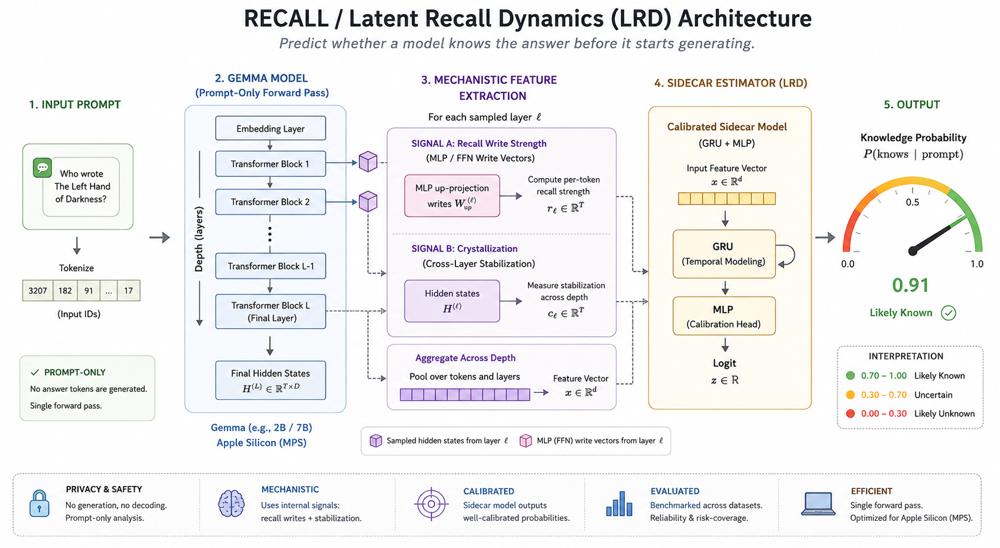

# Latent Recall Dynamics (LRD) — a pre-generation knowledge-boundary estimator

**Question:** *Does the model know the answer before it starts writing it?*

LRD reads a single **prompt-only forward pass** of `google/gemma-4-E4B-it` (no answer tokens are
generated) and predicts whether the model's parametric knowledge is sufficient to answer the
question correctly. A tiny "sidecar" estimator consumes mechanistic features extracted across depth
and emits a calibrated **P(knows)**.

The label is the model's **own behavior**: `knows = 1` iff *this exact bf16 instance* answers the
question correctly (matched against gold answers + aliases). Activations and labels come from the
**same** model instance — so the estimator predicts what the model will actually do, not world-truth.



### Examples

```text
Question: Who wrote The Left Hand of Darkness?
Recall: P(knows) = 0.91 ✅ likely known

Question: What is the capital of a fictional country?
Recall: P(knows) = 0.08 ❌ likely unknown
```

---

## Method — three signal families → a small sidecar

- **Signal A — crystallization trajectory.** Apply the logit lens (final RMSNorm → tied output
  embedding → `tanh` softcap 30.0) at the final prompt position at *every* layer. Track entropy,
  top-1 margin, inter-layer KL, and the settling layer. Known facts crystallize early; unknown ones
  stay diffuse.
- **Signal B — MLP recall-write specificity (centerpiece).** Direct logit attribution on each
  layer's MLP write (the additive feed-forward contribution to the residual stream). Measure its
  relative norm, peakedness (negentropy of its vocab projection), and directional coherence across
  the mid-layer "recall band". A confident factual recall shows a strong, peaked, coherent write.
- **Signal C / D** — perturbation robustness and Mahalanobis familiarity. Scaffolded behind config
  flags, **default off**; not used by the v1 sidecar.

The sidecar is a small GRU over depth (`[L, F]` → mean+last pool) concatenated with global scalars
→ MLP → one logit, trained with class-balanced BCE and temperature-scaled for calibration
(~5×10⁴ params).

---

## Hard constraints (by design)

- **Apple Silicon / MPS only.** No CUDA assumptions anywhere. Peak memory stays under ~24 GB.
- **bf16 throughout** (`attn_implementation="eager"`, `PYTORCH_ENABLE_MPS_FALLBACK=1`). Not fp16.
- **No GGUF / llama.cpp / Ollama.** Activations *and* labels must come from one bf16 instance, so a
  quantized runtime is never used for extraction or labeling.
- **Features are stored, never raw activations.** Each capture is detached → moved to CPU → cast to
  float16 → freed immediately.
- Model dimensions are read from `model.config` at runtime (42 layers, hidden 2560, vocab 262144,
  131072-token native context, softcap 30.0 for this checkpoint) — nothing is hardcoded. Thinking mode is **off** for the
  prompt-only capture and the self-behavioral labeling, so features and labels match the
  no-thinking generation the sidecar predicts; the GUI's interactive generate buttons are the one
  exception (they enable it for the head-to-head answer comparison).

---

## Setup

Tested on **Python 3.12, Apple Silicon (MPS)**. From a fresh clone:

```bash
python -m venv .venv && source .venv/bin/activate
pip install -r requirements.txt
```

`requirements.txt` pins the versions used to produce the shipped artifacts, for reproducibility.

**Gemma weights (needed only for the live model — see Quick start below).** `google/gemma-4-E4B-it`
is gated: request access on its [Hugging Face model page](https://huggingface.co/google/gemma-4-E4B-it)
(this accepts Google's Gemma license), then authenticate once:

```bash
huggingface-cli login          # use a token that has access to the Gemma 4 weights
# optional — pre-pull the ~15 GB bf16 checkpoint so the first run isn't a surprise:
huggingface-cli download google/gemma-4-E4B-it
```

The checkpoint is loaded once and runs bf16 on MPS. If it isn't accessible, the engine raises a
clear auth error telling you to log in (see `model_engine.py`).

---

## Quick start

The trained sidecar and the precomputed features/metrics **ship in this repo**, so you don't have
to rebuild anything. Two paths need no model download; only live probing does.

1. **Use the pretrained sidecar (default).** With the Gemma weights set up (above), launch the GUI:

   ```bash
   python -m kbe.app
   ```

   The Probe and thought-seed buttons run the live model (one forward pass per question); the
   Evaluation tab shows the shipped metrics and figures. The green/red thresholds in
   `config.yaml` already match the shipped `ckpts/lrd.pt` — no training step required.

2. **Reproduce the evaluation offline (no model download).** Because `data/feats.npz` ships with
   the extracted features, you can regenerate metrics + figures, and even retrain the sidecar,
   with just torch + scikit-learn:

   ```bash
   python -m kbe.evaluate          # rewrites data/metrics.json + data/figs/ from shipped features
   python -m kbe.sidecar           # optional: retrain ckpts/lrd.pt + thresholds from shipped features
   ```

3. **Rebuild everything from scratch.** This is the only path that needs the gated LLM (it extracts
   activations and self-labels ~3000 examples, ~2–3 h on Apple Silicon). See **Run order** below.

---

## Run order

```bash
# 1. Smoke test the full pipeline on 100 examples first (fast sanity check)
python -m kbe.build_dataset --limit 100

# 2. Build the real dataset (~3000 balanced PopQA + TriviaQA examples; ~2–3 h on Apple Silicon)
python -m kbe.build_dataset

# 3. Train the LRD sidecar + baselines; writes calibrated thresholds back into config.yaml
python -m kbe.sidecar

# 4. Evaluate vs baselines on held-out + cross-dataset splits; writes figures + metrics.json
python -m kbe.evaluate

# 5. Launch the interactive GUI
python -m kbe.app
```

Each stage reads `kbe/config.yaml` (model id, recall band, signal flags, dataset sizes, thresholds)
and writes its outputs under `data/` and `ckpts/`.

---

## What you get

- **`build_dataset`** → `data/dataset.parquet` (one row per example: id, dataset, question,
  popularity, label, prediction, strongest-write token) and `data/feats.npz` (aligned feature
  arrays), plus stratified and cross-dataset splits in `data/splits.json`.
- **`sidecar`** → trained `ckpts/lrd.pt` + `ckpts/baselines.joblib`, and green/red verdict
  thresholds in `config.yaml`.
- **`evaluate`** → AUROC / AUPRC / ECE, reliability diagram, risk–coverage curve, PopQA
  popularity-sliced AUROC, and a baseline-comparison table (LRD vs last-layer probe vs global-scalar
  logreg vs negative-entropy trivial baseline). Figures land in `data/figs/`, summary in
  `data/metrics.json`.
- **`app`** (Gradio + Plotly) — three tabs:
  - **Probe**: type a question → calibrated P(knows) gauge with a green/amber/red verdict, the
    Signal-A crystallization trajectory, the Signal-B MLP recall-write chart (strongest layer
    highlighted), and a "what's forming" logit-lens table. Two **generate** buttons then check the
    actual answer (optionally matched against pipe-separated gold answers). For a fair head-to-head,
    both run with the model's **thinking channel enabled** and the **same generation budget** — it
    generates until the model stops, bounded by the configured context window (`model.context_window`
    in `config.yaml`, 4096 by default; ≤ the model's native 131072) — so the sole difference is the seed:
    - **baseline** — thinks and answers with no confidence signal injected.
    - **thought seed** — feeds the model its *own* calibrated P(knows) back into the open thinking
      channel. The seed states the probability as a percent and, graded by adjustable low/high band
      cutoffs (default 0.4 / 0.7), directs the model to either answer confidently, lead with a hedge,
      or admit it doesn't know; the model then finishes the seeded thought and emits its answer.
  - **Evaluation**: the saved held-out / cross-dataset metrics and figures.
  - **Info**: resolved config, recall band, thresholds, and live memory.

---

## Repository layout

```
kbe/
  config.yaml        resolved run configuration (model, band, flags, thresholds)
  model_engine.py    Engine: load on MPS, prompt-only capture with MLP-write hooks, logit lens, generate (baseline + thought-seeded)
  features.py        Signals A & B → per-layer feature matrix [L,F] + global scalars
  build_dataset.py   capture features + self-behavioral labels for PopQA + TriviaQA
  sidecar.py         LRD GRU estimator + logistic baselines + calibration + thresholds
  evaluate.py        metrics, reliability / risk-coverage figures, baseline comparison
  app.py             Gradio + Plotly GUI
data/                datasets, features, splits, figures, metrics (precomputed set committed; logs + resume checkpoints gitignored)
ckpts/               trained sidecar + baselines (committed, so you can use them without retraining)
```

---

## Caveats

- PopQA targets long-tail entities, so this model's PopQA accuracy is genuinely low — that low
  base-rate is the *point*: it gives the estimator a hard "unknown" distribution to separate from
  the easier TriviaQA "known" distribution.
- The raw logit lens of an MLP *write* reads noisy mid-stack tokens (an untuned-lens artifact); it
  is the write **magnitudes** (peak, relative norm) that carry the usable Signal-B information. The
  GUI's "what's forming" table uses the Signal-A hidden-state lens, which is well-behaved.
- The first model forward after load is warmed up internally to avoid an MPS first-pass logit
  artifact.

---

## License

The code in this repository is released under the [MIT License](LICENSE). The Gemma model weights
are **not** part of this repository and are governed by Google's separate
[Gemma license](https://ai.google.dev/gemma/terms), which you must accept to download them.
